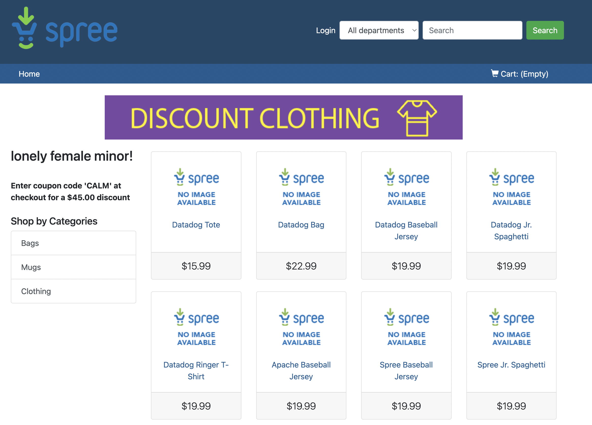

# Deploying Datadog Agent and Applications!

This repo is based on [Automate Monitoring with the Terraform Datadog Provider tutorial](https://developer.hashicorp.com/terraform/tutorials/applications/datadog-provider), which has been extended to deploy the eCommerce application using HCL.

If you want to run this code locally update the kubernetes.tf file with the following

Instead of this

```bash
data "terraform_remote_state" "eks" {
  backend = "remote"

  config = {
    organization = var.org_name
    workspaces = {
      name = "eks-cluster"
    }
  }
}
```

Use this

```bash
data "terraform_remote_state" "eks" {
  backend = "local"

  config = {
    path = "../eks-cluster/terraform.tfstate"
  }
}
```

and remove the `org_name` variable from the `variables.tf`

You can define the rest of the variables using a **tfvars** file

---

The files advertisements.tf, db.tf, discount.tf and frontend.tf are the result of running

```bash
tfk8s -f input.yaml -o output.tf
```

on the different yaml manifest that comprised the eCommerce application, where input and output should be changed with the name portion of the manifest (advertisement, db, and so on). They have made available within the eCommerce_app folder and have been taken from the original repository [DataDog/ecommerce-workshop](https://github.com/DataDog/ecommerce-workshop/tree/main/deploy/generic-k8s/ecommerce-app).

`kubernetes_manifest` resource API do not expose details of the Kubernetes API objets and for that reason, we have modified the `frontend deployment` and `service` so we can output the service FQDN. With that service FQDN we can then create a synthetic test. Therefore, `frontend.tf` resources do not follow the same approach as `advertisement.tf`, `db.tf` and `discounts.tf`.

Finally, the helm chart values have been extended with the following values

```bash

  set {
    name  = "datadog.apm.portEnabled"
    value = true
  }

  set {
    name  = "datadog.processAgent.enabled"
    value = true
  }

  set {
    name  = "datadog.networkMonitoring.enabled"
    value = true
  }

  set {
    name  = "datadog.kubelet.tlsVerify"
    value = false
  }

  set {
    name  = "datadog.processAgent.processCollection"
    value = true
  }

  set {
    name  = "datadog.clusterName"
    value = "ecommerce"
  }
```

---

Use the output variables to show and connect with the applications deployed!


**frontend output** shows the Datadog Ecommerce Application



whereas the **web_endpoint** url is for a simple app based on NGINX.


